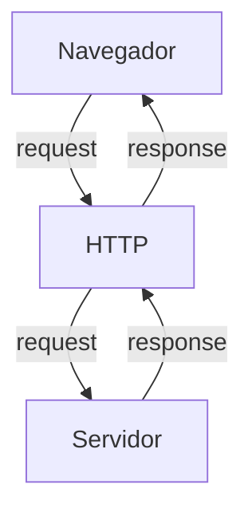
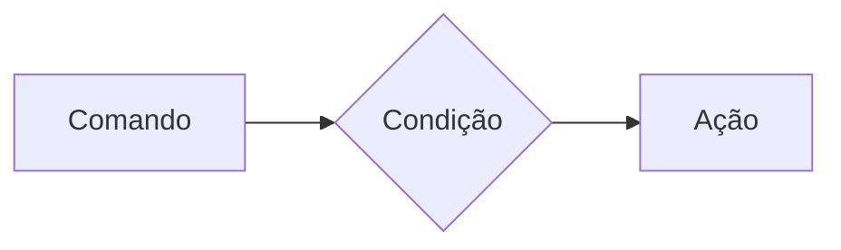
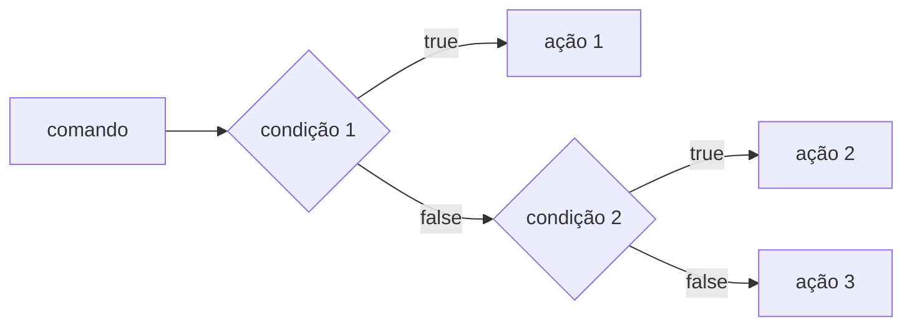
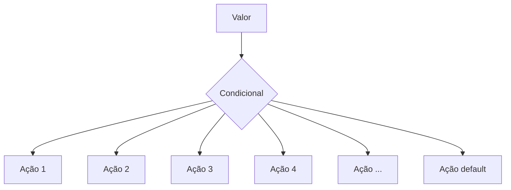
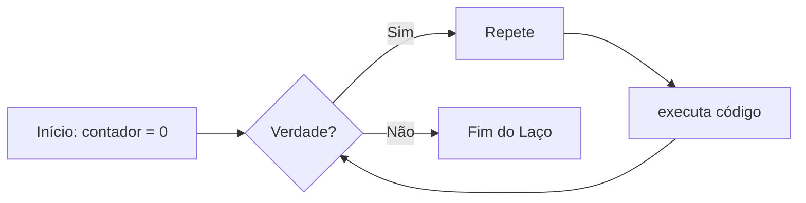
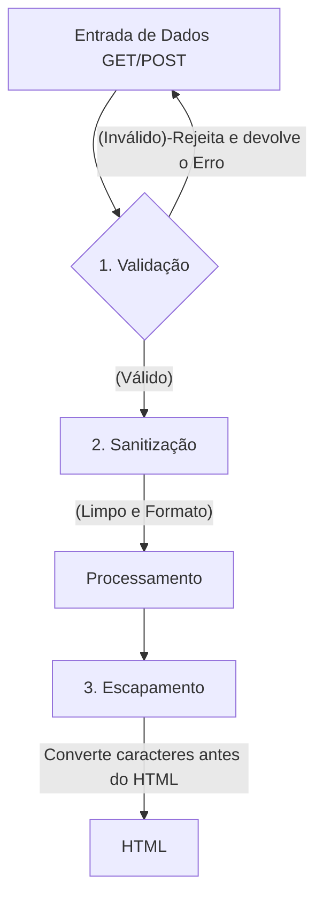

# Curso BackEnd - 225h - Técnico em Desenvolvimento de Sistemas - SENAI

Profº Diogo TB

Escola SENAI Americana

2º Semestre 2026

## Objetivos do Curso

- Desenvolver Aplicações web Server Side, utilizando a linguagem PHP;
- Aplicar Sisntaxe Nativa PHP (Vanilla);
- Manipulação HTTP;
- Persistência de Dados;
- Segurança contra SQL Injection/CSRF;
- Refatoração em POO (Programação Orientada ao Objeto);
- Arquitetura MVC (Model, View, Controller);
- Utilização do FrameWork Laravel; 

obs: framework - um conjunto de bibliotecas que oferecem uma solução completa para o desenvolvimento de alguma coisa

## Cronograma do Semestre

Carga Horária: 105h 1º Semestre e 120h 2º Semestre

Duração: 20 Semanas 1º Semestre e 20 Semanas 2º Semestre

---

### Semana 1: Introdução ao BackEnd e Configuração do Ambiente PHP

#### O que é BackEnd?

O back-end é a parte de uma aplicação que o usuário não vê, mas que faz tudo funcionar por trás das telas.

O Back-End é a parte de um sistema que funciona nos servidores, sendo responsável por executar a lógica da aplicação, processar informações e armazenar dados. 

Além disso, o BackEnd é responsável por atender ás solicitações do Frontend.

**Sobre o mercado atual:** o cenário é bom, mas mais exigente do que era. Quem conhece só o básico enfrenta mais concorrência. Quem alia backend sólido com IA aplicada, cloud e inglês está num patamar completamente diferente — vagas internacionais remotas são uma realidade pra esse perfil.

O Backend é formado pelo servidor, banco de dados, lógica de programação com APIs e linguagens de programação/frameworks. Esses componentes trabalham juntos para processar dados, armazenar informações e garantir o funcionamento da aplicação.

**Para que serve**

- Processar lógica de negócio: regras, cálculos, validações (ex: calcular frete, aplicar desconto, validar login)
- Gerenciar banco de dados: salvar, buscar, atualizar e deletar informações
- Autenticação e autorização: controlar quem pode acessar o quê (login, senhas, permissões)
- Fornecer APIs: criar "pontes" (endpoints) para o frontend ou outros sistemas consumirem dados
- Integração com serviços externos: pagamentos, e-mails, notificações, APIs de terceiros
- Segurança: proteger dados sensíveis, evitar ataques (SQL injection, XSS, etc.)
- Escalabilidade e performance: garantir que o sistema aguente muitos usuários ao mesmo tempo.


**Principais Tecnologias Linguagens de programação:** 
Ferramentas usadas para escrever o código do servidor, como Python, Node.js (JavaScript), Java e PHP.APIs: Os "caminhos" que permitem que o que você vê no celular converse com o servidor.

**Areas de Atuação**
- Fintechs e Bancos
- Segurança, transações, alta escala 
- E-commerce
- Catálogo, pedidos, pagamentos
- Healthtechs
- Prontuários, telemedicina
- SaaS / Startups
- Backend é o coração do produto
- Logística
- Rastreio, rotas, tempo real
- Educação
- Plataformas, conteúdo, usuários

#### O Ciclo de Vida da Requisição HTTP

##### O que é HTTP?

*HTTP*, Hypertext Transfer Protocol, é um protocolo de comunicação utilizado para transferência de informações na WWW (World wide Web) e em outros sistemas de redes.

O HTTP é a base para que o cliente e um servidor web troquem informações. Ele permite a requisição e a resposta de recurso como, imagens, arquivos e textos.




#### Como Funciona na Prática o BackEnd

- **Ação do Usuário**: Envia uma Solicitação pela UI(Interface do Usuário). Exemplo de UI: Tela do Celular, Navegador da Internet, Alexa, IOT ...
- **Enviar uma Requisição**: A UI transforma ação do Usuário em uma Requisição HTTP.
- **O Processamento BackEnd**: O Código BackEnd recebe o pedido, valida os dados e decide o que fazer. Ex: consultar uma informação no BD(Base de Dados).
- **Resposta**: O servidor devolde o resultado para a UI. Ex: Um Login Autorizado, Confirmação de uma Compra...

#### Tipos de Requisição HTTP

Os tipos de requisição HTTP indicam a ação que o usuário deseja executar no servidor. As principais ações são:

- **GET**: Pede dados de um lugar especifico do servidor. "Não Faz Alterações no Servidor"
- **DELETE**: Apaga um Dados do Servidor.
- **POST**: Envia dados novo para *criar* algo ou processar informações no servidor.
- **PUT/PATCH**: Modificaar um dados já existente. 

---

#### Iniciando o PHP

**PHP** (HyperText PreProcessor) é uma linguagem de programação interpretada e open source, focada no desenvolvimento de sistemas para web, pode ser usada junto com HTML para criação de páginas web dinâmicas.

O PHP de fato é yma das linguagens de programação mais populares da atualidade. Ela permite que você crie aplicações web robustas, de uma muito simplificada e direta. A linguagem tem diversos recursos que facilitam e aceleram o ´processo de desenvolvimento de sites e sistemas para web. E além od mais, ela ainda tem um ótimo ecossistema, uma excelente comunidade e um grande mercado de trabalho.

##### Instalando o PHP

- Fazer o Download do PHP (php.net)
- ZIP - NTS(Non Thread Safe) 8.5
- Descompactar o Arquivo do PHP na pasta C:src\php (Para Descompactar usar o 7Zip = Melhor) => nunca salvar arquivo ou programas na raiz do sistema(C:)
- Adicionar a Pasta do PHP(C:\src\php) as Variáveis de Ambiente do Sistema (PATH)
- Verificar a Instalação rodando o comando *php --version*

##### Criando Minha Primeira Aplicação em PHP

1. antes de começar a codar:

- preparar meu VSCODE
- criar um profile prooprio para o PHP 
- instalamos as Esxtensões necessraia para transformar o VScode em uma IED:
        -PHP Intelephense => permite a utilização de Snippets(atalhos de Código)
        - PHP Debug => ajuda a agente encontrar os erros de codigos 
        - PHP Cs Fixer => formatação de codigos (identação)
        - PHP Server => ajuda na criação de um servidor local de PHP 
      -desabilitamos o PHP nativo do vscode (@builtin PHP)  

      2. hello Word (muito importante!!!!!!!!!)

      ### semana 2 - Variaveis, Constante e Operadores em PHP

      ##### estudo de variaveis e constantes em PHP

      declarar variáveis é colocar um espeço na memoria que permite a inclusão e manipulação de daodos.

      **variaveis**

      -devm ser declaradas usando "$" antes do nome da variável 
      - são tipadas ( não precisa declarar  o tipo de dela na criação) , 
      - podem ser String, Numéricas (interagir e float), Booleans e nulas. não permite declaraçãio de undefinded 
      - Usar o "declare(Strict_types=1);" na primeira linha do arquivo; => blinda o sistema contra conflitos de tipos de variáveis

**Constantes**

- não poodem ser mudadas ou redeclaras após a criação
- pode ser criada usando "const" ou "define"
- não permite interpolação

##### estudo de operadores

**aritimedicos**: são usado para realizar calculo

|operador | nome| exemplo | resultado |
| - | - | -| - |
|+  |adição  | 10+5 | 15 |
| - | subtração | 10-5 |5 |
|*  | multiplicação | 10*5 | 50 |
|/  | divisão | 10/5 | 2 |
| % | modulação(resto) | 10%3 | 1 (10 div 3 da 3, sobra 1) |
| ** | Expoente | 2**3 | 8(2 elevado a 3) |

obs: O Operador % é o melhor amigo de um programador , permite ordenar listas e organizar fila e pilhas

**Relacionais**:  Permite o Relacionamento entre dois ou mais valores, o resultado de uma operação é sempre uma booleana (verdadeiro ou falso).

| operador | significdo | exemplo | rsultado |
| - | - | - | - |
| > | maior que | 18 > 18 | false |
| >= | maior ou gual a | 18 >= 18 | true |
| < | menor que | 10 < 20 | true |
| <= | menor  ou igual a | 10 <= | false |
| == | comparação de valor | "10" ==10 | true |
| === | comparação estrita  | "10"===10 | false |
| != | Diferente | "10"!='10 | false | 
| !== | distritamente Diferente | "10"!==10 | true |

**Lógicos**: permite a cobininação entre sentenças.

- operador AND (E) => && : para o resultado ser verdadeiro, Todas as Combinações precisam ser verdadeira
    - true && true => true
    - true && false => false

- Operador OR (OU) => || : para o resultado ser verdadeiro, basta apans uma condição ser verdadeiro,basta apenas uma condição ser verdadeira 
   - alse || true => true
    - false || false => false

- Operador NOT (Não) => ! : Inverte a lógica da Operação, 
    - !true => false
    - !false => true 
    
    ---

    ### Semana 3 - Estrutura de controle de Dados (condicionais e repetição)


-**conteúdo**: esstrutura `if,` `else`, `elseif`, operadores ternarios, `match` => substuindo do `switch/case`, loops `for`, `while`, `do-while` e `foreach`

#### Estruturas de Controle da Dados Ajudam no Processo de Automatização em Programas e Sistemas

##### Condicionais (IF, ELSE, ELSEIF)

**Formas de Uso**

- uso do `if` apenas:
Exemplo: aplicar desconto de 10% em compras acima de 100 Reais;



```php

if($valorCompra > 100){
    $valorFinal = $ValorCompra * 0.9;
}


```

- Uso do `if` e do `else`
Exemplo: aplicar um desconto de 10% para acima de 100reais e 5% para as demais compras 

```mermaid

GRAPH LR
A[comando] -->B{condição}
B --> |true| C[Ação 1]
B --> |false| D[Ação 2]

```

```php
if($valorCompra > 100){
    $valorFinal = $valorCompra * 0.9;
} else {
    $valorFinal = $valorCompra * 0.95;
}

```

- Uso `elseif` (IF encadeado) etrutura usada para manipulação de dados em duas ou mais condicionais.
Exemplo: Compras acima de 200 reais tem 15% de desconto, compras acima e 10 reais tem 10% de desconto e demais crompras tm 5% desconto


```php

if($valorCompra > 100){
    $valorFinal = $valorCompra * 0.9;
} else {
    $valorFinal = $valorCompra * 0.95;
}

```

*obs*: sempre usar `elseif`para situações para que precisam de mais de uma condição, ou seja fazer encadeamento das condições 

- Uso *ERRADO* do if 

```php

f($valorCompra > 200) {
    $valorFinal = $valorCompra * 0.85;
}
if($valorCompra > 100) {
    $valorFinal = $valorCompra * 0.9;
} else {
    $valorFinal = $valorCompra * 0.95;
}

```

##### Operadores Ternários

um atalho para a estrutua de condicional `if/else`, normalmente escrito em uma única linha de codigo

` condição ? verdadeira : falsa `

pefeito para desisões curtas de uma linha de comando 

Exemplo: verificar se a pessoa é maior de idade (18);

```php

$idade = 20;
//O formato é (condição) ? Vedadeiro : Falso;

$status = ($idade>=18) ? "maior de idade" : "menor de idade";
$status2 = ($idade>=60) ? "Idoso" : ($idade>=18) ? "Adulto" : "Criança" ;

echo $status //
```

##### Expressão Condicional `match` (PhP 8)

No mercado atual de PHP, não se uma mais uma `Switch/Case` para chegar valores fixos, usa-se o `match`. Ele compara um valor e retoran diretamente o resultado caso atenda a condição.


Exemplo: Selecionar o Dia da Semana a partir de um Nº 

```php

$diaSemanaNum = date("W"); // pega o Dia da Semana em formato numérico

$nomeDiaSemana = match($diaSemanaNu) {
    "0" => "Domingo",
    "1" => "Segunda",
    "2" => "Terça",
    "3" => "Quarta",
    "4" => "Quinta",
    "5" => "Sexta",
    "6" => "Sábado",
    "default" => "Dia Inválido"
};

echo " Hoje é : $nomeDiaSemana";

```

---

##### Laços de Repetição

Um laço de repetição faz com que um bloco de código rode várias vezes até que uma condição mande parar. 

- O Laço while (Enquanto)

Ele verifica se a condição é verdadeira ANTES de entrar no laço. Ideal quando você não sabe exatamente quantas vezes vai rodar o laço. 



exemplo de Aplicação do while: jogo de adivinhação de um nº  secreto 

```php 
$numeroSecreto = rand(1,10);

$tentativas = 0;

$numeroEscolhido = 0;

while(numeroEscolhido != NumeroSecreto){
    echo "tente Novamente"
    //vou Escolher outro Nº para adivinhar 
    numeroEscolhido = rand(1,10);
    tentativas++;
}

echo "certou miseravel!!! o nº secreto é $numeroEscolhido";

```


- O Laço `do-while` (faça - Enquanto)

A diferença é que ele executa o bloco pelo menos uma vez, mesmo que a conduição seja false desde o inicio, pois ele só pergunta no final.

```mermaid 
 
 flowchart LR

    A([inicio]) -> B[Ação]
    B --> C{Condição}
    C --true--> B
    C --false--> D([Fim])

```

Exemplo: Jogo de Adivinhação de um nº

```php

 $numeroSecreto = rand(1,10);

do{
    $numeroEscolhido = rand(1,10);

    if(numeroEscolhido == numeroSecreto){
        echo "Parabéns, Acertou!!!";
        break;
    }
    echo "Tente Novamente!!!";

} while(numeroEscolhido != numeroSecreto);


```

##### O Freio de Emergência: `break` e `continue`

As vezes precisamoso interferir no laço enquanto ele está rodando 

`break `=> **para tudo** Quebra o laço interiro e avai embora
- `continue` => **Pula a rodada!** Ele ignora o código daquela rodada especifica e pula logo par a próxima repetição.

Exemplo de Aplicação do Código: Sistema de Controle do Elevador

```php

for($andar = 1 ; $andar<=10; $andar++){
    if($andar ==4){
        echo "Andar $andar está em obras. Passando direto!";
        continue;
    }

    echo "Elevador parou no andar $andar"
}

```
---

##### Laço de Repetição `for`

Use o `for`quando você sabe quantas vezes precisa repetir uma ação ou quando precisa controle um contador. Ele possui três partes:

- inicialização,
- condição,
- incremento;

for(inicialização; condição incremento){
    ação
}

```
lowchart LR
    A[Início: i=0] --> B{i<10?}
    B --true--> C[Ação]
    C --> D[i++]
    D --> B
    B --false--> E[Fim]

```

Exemplo: Exibir todos os meses do Ano

```php
for($mes=1; $mes<=12; $mes++){
    echo "Mês $mes";
}
```
Nesse Exemplo, `$mes`começa em 1, o laço continua enquantio `$mes`for menor ou igual a 12 e, ao final de cada repetição, `$mes++`aumenta o contador em 1.

##### Laço de Repetição `foreach`

use o `foreach` quando precisar percorrer cada item de um *array*. Ele acessa os elementos diretamente, sem que você precise controlar o contador.

Exemplo: Imprimir todos os items de um vetor

```php

$frutas = ["Maça", "Banana", "Uva", "Pera"];

foreach($frutas as $fruta){
    echo "Fruta: $fruta";
}
```

Outro Exemplo: Acessar a chave e o valor de cada item:

```php 

$precos = [
    "Caderno" => 25.90,
    "Caneta" => 5.50,
    "Mochila" => 99.00
]; // vetor não ordenado chave => valor

foreach ($precos as $produto => $preco){
    echo "$produto: R$ number_format($preço,2)";
}

```

---
---
#### Desafio : Simuladro de Cobrança (FINANSENAI) 

### desafio final 

---
---

### Semana 4 - Modularização com Funções

#### Principio do DRY ( `Don´t Repeat) Yourself`) 

Se uma lógica foi escrita duas ou mais dentro de um codigo, essa logica deve virar uma função.

#### funcões nativas do php 

O php tem milhares de funcões prontas, essa funcões são chamadas de nativas.

-**o que é uma função**

uma função é como uma maquina: voce coloca uma materia-pria(parametro), ela procesa e devolve um produto final

exemplo de Função Nativa:

```php 

$texto = "senai americana";

//str_replace(le abusca um pedaço do texto e substitui por outro)
textoNovo = str_replace("americana","são paulo",$texto);

//strtwopper 
echo strtoupper($textoNovo); // senai são paulo


```

##### Principais Funções Nativas ( Mais Utilizadas )

As funções abaixo já fazem parte do PHP e podem ser chamadas diretamente no código. Observe os parâmetros que cada uma recebe e o tipo de informação que ela retorna.

| Função | Categoria | O que faz | Como usar |
|---|---|---|---|
| `strlen()` | Strings | Retorna a quantidade de caracteres de um texto. | `$tamanho = strlen($texto);` |
| `strtoupper()` | Strings | Converte o texto para letras maiúsculas. | `$resultado = strtoupper($texto);` |
| `strtolower()` | Strings | Converte o texto para letras minúsculas. | `$resultado = strtolower($texto);` |
| `ucfirst()` | Strings | Converte a primeira letra do texto para maiúscula. | `$resultado = ucfirst($texto);` |
| `trim()` | Strings | Remove espaços e quebras de linha no início e no fim do texto. | `$limpo = trim($texto);` |
| `str_replace()` | Strings | Substitui uma parte do texto por outra. | `$novo = str_replace("-", "", $cpf);` |
| `substr()` | Strings | Extrai uma parte do texto a partir de uma posição. | `$inicio = substr($texto, 0, 3);` |
| `explode()` | Strings | Divide um texto e cria um array usando um separador. | `$palavras = explode(" ", $nome);` |
| `implode()` | Arrays | Junta os itens de um array em um único texto. | `$lista = implode(", ", $nomes);` |
| `count()` | Arrays | Conta a quantidade de itens de um array. | `$total = count($produtos);` |
| `in_array()` | Arrays | Verifica se um valor existe dentro de um array. | `$existe = in_array("SP", $estados, true);` |
| `array_push()` | Arrays | Adiciona um ou mais itens ao final de um array. | `array_push($nomes, "Ana");` |
| `array_pop()` | Arrays | Remove e retorna o último item de um array. | `$ultimo = array_pop($nomes);` |
| `sort()` | Arrays | Ordena um array em ordem crescente e reorganiza suas chaves. | `sort($notas);` |
| `array_keys()` | Arrays | Retorna um array contendo as chaves de outro array. | `$chaves = array_keys($produtos);` |
| `number_format()` | Números | Formata um número com casas decimais e separadores definidos. | `$preco = number_format($valor, 2, ',', '.');` |
| `round()` | Números | Arredonda um número para a quantidade de casas informada. | `$media = round($nota, 2);` |
| `max()` | Números | Retorna o maior valor de uma lista ou array. | `$maior = max($notas);` |
| `min()` | Números | Retorna o menor valor de uma lista ou array. | `$menor = min($notas);` |
| `is_numeric()` | Validação | Verifica se o valor é um número ou uma string numérica. | `if (is_numeric($entrada)) { ... }` |
| `isset()` | Validação | Verifica se uma variável existe e não possui valor `null`. | `if (isset($usuario)) { ... }` |
| `empty()` | Validação | Verifica se uma variável está vazia. | `if (empty($pedido)) { ... }` |
| `date()` | Data e hora | Formata uma data ou hora conforme uma máscara. | `$hoje = date('d/m/Y');` |
| `file_exists()` | Arquivos | Verifica se um arquivo ou diretório existe. | `if (file_exists('dados.txt')) { ... }` |
| `file_get_contents()` | Arquivos | Lê todo o conteúdo de um arquivo ou endereço. | `$conteudo = file_get_contents('dados.txt');` |
| `file_put_contents()` | Arquivos | Grava conteúdo em um arquivo, criando-o se necessário. | `file_put_contents('log.txt', $mensagem);` |

**Atenção:** algumas funções modificam o array original, como `sort()`, `array_push()` e `array_pop()`. Já outras retornam um novo valor, como `count()`, `explode()` e `str_replace()`. Em caso de dúvida, consulte a documentação oficial do PHP e verifique o retorno da função.


##### Documentação PHP

[Acesse a documentação oficial do PHP em português](https://www.php.net/manual/pt_BR/)

Consulte também a [referência de funções do ](https://www.php.net/manual/pt_br/funcref.php) para pesquisar a sintaxe, os parametros eos valores por cada função.


#### funções customizadas (criandi suas proprias maquinas)

quando o php não tem função que queremos, nos a criamos!

**A regra de ouro** uma função deve focar em `return`(retornar um valor), e não imprimir (`echo`). 

Veja a diferença nesse exemplo:
```php

function calcularTotal($preco, $quantidade){
    return $preco * $quantidade;
}

$total = calculartotal(25.00.3)

echo "total da compra: R$$ " . number_format($total,2 ",",",");

```

A função `calculartotal()` pode ser reutilizada em uma pagina, relatório ou teste. O `echo`aparece somente fora da função, no momento de apresentar o resultado ao usuário

##### Padrão de Uso Corporativo (PHP 8 Strict Types)

No merdado de trabalho, exigimos que a função avise extamente o **TIPO** de dado que ela espera receber e o **TIPO** que ela vai devolver

isso é chamado de **tipagem de funções**. ao declara os tipos, o codigo fica mais facil de entender e o php consegue identificar alguns erros antes que eles causam problemas maiores no sistema.

os tipos mais usados:

* `int`: número inteiro, `10` ou `1024`.
* `float`: número decimal ou ponto flutuante, `10.50`.
* `string`: texto, como `"Maria"`
* `bool`: valor lógico, `true` ou `false`.
* `void`: identifica que a função não devolve nenhum valor

O tipo deve ser escrito antes do nome de cada parâmetro e o tipo da função deve ser escrito após os parênteses, precedito po `:`, informando o que a função vai devolver.

Exemplo de uso de função e parâmetros tipados:

```php
function apresentarProduto(string $nome, float $preco): string{
    return "$nome cuta R$ $preco";
}

$mensagem = $apresentaproduto("caderno",25.90)
echo $mensagem;


```


> **Resumo**: os tipos dos parâmetros documetam as entradas da função, o tipo após `:` documeta a saída da função

##### O Tipo Mágico : `void`

Se uma função faz um trabalho interno e **não retrona NADA**, dizemos que o retorno dela é "vazio" (`void`).

Exemplo de função sem retorno:

```php
function registroLog(string $mensagem): void{
    //apenas salvar em um arquivo de texto, não devolver nenhuma variável
    file_put_contents("erro.log",$mensagem);
}
```

#### escopo e referencia (o segredo da memoria)

##### o que é escopo? (regras de lavegas)


*O que acontece dentro da função, fica dentro da função*. Uma variável criada fora  nã existe lá dentro, e uma criada lá dentro morre quando a função acaba.

**Escopo** é o local do programa onde a variável pode ser armazenada/acessada. Em PHP, uma variável criada fora de uma função pertende ao **escopo global**. uma variável criada dentro de uma função pertence ao **escopo local**.

Exemplo de Escopo de variável:

```php 
$nomeSistema = "CRM Senai"; //Variável global
//CRM: criar mensagem

function criarMensagem():string{
    $mensagem = "Bem-Vindo!"; //Variável Local
    return $mensagem;
}

echo $nomesistema; //correto esta no escopo global
echo criarMensagem(); //Correto: a função devolve sua variável local.
echo $mensagem; // Incorreto: $mensagem só existe dentro da função, não é acessada fora
```

* Como enviar dados para uma função?

A forma mais segura e organizada é enviar os dados por **parâmetros**. assim, a função não precisa acessar diretamento variaveis globais:

```php
function saudar(string $nome):string{
    return "Olá, $nome!";
}

$nomeCliente = "João";
echo saudar($nomeCliente); // Olá, João!
```

Nesse caso, `$nomeCliente` continua no escopo global, mas seu valor é enviado para o parâmetro local `$nome`. A função recebe uma informação, processa e retorna o resultado.

Exemplo Incorreto:

```php
$nome = "João";
function saudar():string{
    return "Olá, $nome";
}
```

a função `saudar()` não conhece a variavel globla `$nome`

> **Resumo:** variáveis protegem os dados internos da função; parâmetros são o caminho recomendado para evitar Erros e enviar Informações, e `return`é usado para devolver um resultado ao código que chamou a função.

---

### Semana 5 - arrays e Manipulação de dados Avançada de dados 

um array(também conhecido como vetor) é uma estrutura de dados usadas para armazenar vários valores em uma unica variáveis.

**Tipos de arrays em PHP:**

- indexados/ordenado(Numerica): inteiros como indices(chaves), que começam em zero por padrão;
- Associativos/NãoOrdenados(String): Usam chaves(String) para identificar valores;
- Multidimensionai: contem um ou mais arrays dentro de outro array.

**Exemplos e Arrays**

```php
//array indexado
$frutas = ["maça","banana","lranja"];

//array associativo
$capitais = [
    "SP" => "São Paulo",
    "RJ" => "Rio de Janeiro",
    "MG" => "Belo Horizonte",
    "ES" => "Vitória",
];
//acessando os dados dos arrays 

echo $frtas[1];// banana
echo $capitais["MG"]; //Belo Horizonte
```

> Obs: em arrays associativos, nos trocamos os numeros do indici por nomes(chaves/keys). na declaração do vetor usamos setinha(=>) que significa "recebe"

#### Arrays Multidimensionais (Banco de Dados na Memória)

é aqui que o "backend" começa e verdade. o array Multidimensional é o formato como os brancos de Dados e apis respondem as solicitações feitas pelo BackEnd.

**Exemplo de array Multidimensional:**

```php
$clientes = [
    ["id" => 1, "nome" => "Ana", "email" => "ana@email.com", "ativo" => true],
    ["id" => 2, "nome" => "Bruno", "email" => "bruno@gmail.com", "ativo" => false],
    ["id" => 3, "nome" => "Carlos", "email" => "calos@hotmail.com", "ativo" => true],
];

//Como Acessar o Email do Carlos
echo $clientes[2]["email"]; // carlos@hotmail.com
```

#### O Melhor amigo dos Array: `O Foreach`

O laço de repetição especial para arrays. O `foreach` percorre cada elementos de um array

**Exemplo de Aplicação:**

```php
foreach($clientes as $clienteAtual){
    echo $clienteAtual["nome"];
    echo $clienteAtual["email"];
}
// vai imprimir nome e email de todos os Clientes do Array
```
#### Transformação de Arrays e Arrow Function

Transformações de arrays são usadas para modificar ou filtrar informações de um array existente

- `array_filter`
Serve para buscar dados em um array e devolver apenas os dados que passarem pelo filtro

```php
$clientesAtivos = array_filter($clientes, fn($c) => $c["ativo"]===true);
//novo array , tera apenas os clientes que a chave ativo for igual a true
```

- `array_map`
Serve para alterar Todos os dados de um array de uma única vez

```php
$produtos = [
    ["id"=>1, "preco"=10.00, "setor"=>"jardim"],
    ["id"=>2, "preco"=15.90, "setor"=>"ferramenta"],
    ["id"=>3, "preco"=23.50, "setor"=>"jardim"],
]
//ajustar o preço de todos os produtos em 10% de aumento

$produtosAjustados = array_map(fn($p) => $p["preco"] = $p["preco"]*1.1, $produtos);
```

> Obs: para a função de filtragem, primeiro selecionamos a array e depois criamos a função de filtro. Para a função de mapeamento, primeiro criamos a função de transformação e depois aplicamos no array.

#### Debugando um Array (Kit de PRimeiros Socorros)

- `print_r`
função usada para exibir informações sobre um array de forma legível em liguagem natural

```php
echo print_r($frutas);
//array
(
    [0] => "maça",
    [1] => "banana",
    [2] => "laranja"
)
```

- `var_dump`
Exibi com mais detalhes as informações de um array ou variável em PHP

```php
echo var_dump($frutas);
// Mostrar Tudo: tipo de dados, o tamanho e o valor
```

---

### Semana 6 - precessamento HTTP e formularios web

#### anatomia de um formulário HTML para backEnd

antes do php processar qualquer informação, precisamos coletar informações no frontEnd através d um `<form>`

**Exemplo de `<form>` HTML**

```html
<form action="processar.php" method="POST">
    <label>Nome Completo</label>
    <input type:"text" id="campoNome" name="nomeUsuario" placeholder="Digite seu Nome">
    <button type="submit">cadastrar</button>
  </form>  
```


**Os 3 Pilares de um formulário**
1. action="processa.php" -> O Destino : Define qual script PHP no servidor recebrá os dados
2. method="POST" -> O Transporte: Define a via de protocolo HTTP que será usada (GET ou POST)
3. name="nomeUsuario" -> A Etiqueta do Dado: É o nome da chave que o PHP usará no array associativo ($_POST["nomeUsuario"])

> obs: Nunca Confundir `id`com `name`no input, o PHP ignora o `id`.

#### O Protocolo HTTP

Quando o usuário clica no botão `type="submit"`, o navegador compila todas as informações dos campos preenchido e dispara um pacote de comunicação padronizado pelo **Protocolo HTTP(Hypertext Transfer Protocol)**.

**Os Formatos de Transferência**

* **Método GET**:: solcitar informações públicas e realizr buscas, mas altamente arriscado para dados privados.
* **Método POST**: As informações viajam guardadas dentro do protocologo. 

#### Testar o uso dos Protocolos HTTP

ok 

#### GET vs POST

1. O Método GET(Consultas e filtros)

o método `get`é utilizado quando a intenção do cliente é **buscar ou filtrar dados** sem alterar o estado do servidor. Os dados enviados via `GET` são anexados diretamente ao final da URL na forma de uma **queryString** no sistema (Ex: cadastro de usuários, finalizações de compra, upload de arquivos)

2. O Método POST (Envio de Cargas Úteis e Mutações)

O método `POST` é utilizado quando o formulário envia dados que devem ser processados para **criar ou modificar registros** no sistema (Ex: Cadastro de usuários, finalizações de compra, upload de arquivos)


#### As SupersGlobais 

AS variáveis superglobais são internos pré-defindoos que estão sempre acessíveis em qualquer parte do script php, sem precisar declarar.

-**$GET**: armazena dados passados pela URL via perametros de consulta(query string);
- **$POST**: recolhe dados enviados por formulários usando método HTTP POST.
-**$_SERVER**: contém informações sobre o servidor, ambiente e caminhos de script

**Porque usar `??` para obter dados da superglobais**?

Usamos o operador de nulidade (coalecência nula)para verificar se o valor da variável não é `nul`, se caso for nul `nul`, atribuimos um outro valor para evitar erros nao script.

**Exemplo de uso**: 

Na primeira vez que uma pagina é aberta o formulario ainda não foi enviado. por tanto a chave pode não existir no array.

```php
$nome = $_POST["nome"];
// escrevendo desta forma pode dar eroo 

// a forma correta de ser escrita é:
$nome = $_POST["nome"] ?? "";
//se $_POST["nome"] não existir, use uma variavel vazia.

// Outra forma de verificar a nulidade é usando if e else 
if(isset($_POST["nome"])){
    $nome = $_POST["nome"];
} else{
    $nome = "";
}

```

>obs: use htmlspecialchars() ao exibir ao valor em HTML => converte caracteres especiais em entidades correspondentes em HTML, evitando que o código seja interpretado erradamente pelo navegador. é usado priincipalmente na seguraça web para eviar ataques de cross-Site-Scripting(XSS)

#### Validação de dados no backend é obriatória.

Muitos Desenvolvedores iniciantes acretitam que colocar atributos ``required`, `type=email` ou `min-0` na <tag> do html é suficiente para proteger o sistema. **isso é uma ilusão!!**. sempre fazer as validações de dados no codigo BackEnd 

##### Funções Nativas Essenciais para Limpeza e Validação de Dados

A validação no Back-End deve acontecer sempre antes do processamento de qualquer dado recebido pelo usuário. Abaixo está uma tabela resumida das funções nativas do PHP usadas com frequência para limpar, verificar e validar entradas de formulário.

| Função | Descrição | Quando usar | Exemplo simples |
| :--- | :--- | :--- | :--- |
| `trim($valor)` | Remove espaços no início e no fim da string | Limpar texto digitado pelo usuário | `$nome = trim($_POST['nome'] ?? '');` |
| `htmlspecialchars($valor, ENT_QUOTES, 'UTF-8')` | Converte caracteres especiais em entidades HTML seguras | Exibir dados na tela sem risco de XSS | `echo htmlspecialchars($_POST['nome'] ?? '', ENT_QUOTES, 'UTF-8');` |
| `filter_var($valor, FILTER_VALIDATE_EMAIL)` | Valida formato de e-mail | Campos de e-mail | `filter_var($email, FILTER_VALIDATE_EMAIL)` |
| `filter_var($valor, FILTER_VALIDATE_INT)` | Verifica se o valor é inteiro válido | Idade, código, quantidade | `filter_var($_POST['idade'] ?? '', FILTER_VALIDATE_INT)` |
| `filter_var($valor, FILTER_VALIDATE_FLOAT)` | Verifica se o valor é número decimal válido | Preço, peso, altura, salário | `filter_var($_POST['preco'] ?? '', FILTER_VALIDATE_FLOAT)` |
| `isset($variavel)` | Verifica se uma variável existe e não é `null` | Garantir que o campo foi enviado | `if (isset($_POST['nome'])) { ... }` |
| `empty($valor)` | Verifica se o valor está vazio | Campos obrigatórios | `if (empty($_POST['senha'])) { ... }` |
| `strlen($valor)` | Retorna o tamanho da string | Exigir mínimo ou máximo de caracteres | `if (strlen($senha) < 6) { ... }` |
| `in_array($valor, $lista, true)` | Verifica se o valor pertence a uma lista permitida | `select`, `radio`, opções válidas | `in_array($categoria, ['A','B','C'], true)` |
| `is_numeric($valor)` | Confirma se o valor é numérico | Validação de número | `if (is_numeric($_POST['quantidade'])) { ... }` |
| `preg_match($padrao, $valor)` | Valida por expressão regular | CPF, CEP, telefone, senha forte | `preg_match('/^\d{5}-\d{3}$/', $cep)` |
| `filter_input(INPUT_POST, 'campo', FILTER_SANITIZE_SPECIAL_CHARS)` | Captura e limpa dados da requisição | Ler entradas com segurança | `$nome = filter_input(INPUT_POST, 'nome', FILTER_SANITIZE_SPECIAL_CHARS);` |


#### preservação de estado em formularios (*Sticky form*)

A técnica do **Sicky form** consiste em imprimir de volta no atributo "value" do input os dados que usuário acaba de digitar caso ocorra um err de validação de dados.

**Exemplo de Uso:**

```php
<div class="campo">
    <label for="nome">nome Completo</label>
    <input type="text" id="nome" name="nome" 
        value="<?= htmlspecialchars($dadosformulario["nome"] ?? "")?>
        cass="<?= isset($ero["nome"]) ? "input-erro" : "" ?>">
       <?php if (isset($erro["nome"])): ?> 
         <span class="erro-texto"><?= $erro["nome"] ?></span>
    <?php endif; ?>

</div>
```

### Semana 7 - segurança no BackEnd - sanitização, Validação e proteção contra XSS

#### 1º Mandamento do desenvolvedor BackEnd -

> NUnca confie no Usuário : Toda entrada de dados vindo de fora do servidor é potencialmente maliciosa até que seja rigorosamene validada, sanitizada e codificada.

quando você disponibiliza um campo de texto e um site, qualquer pessoa qualquer pessoa concta a internet pode digitar códigos maliciosos em vez de texto. se o código BackEnd pega esse texto diretamente sem nenhum tratamento, a ordem de execução de códigos abrirá porta para invasão devastadoras do seu sistema.

#### A Anatomia de um Ataque: O que é Cross-site Scriptng  (XXS) 

O XSS ocorre quando uma aplicação web inclui dados não confiaveis em uma página web sem a devida validação ou escape de caracteres. isso permite que um atacante execute scripts maliciosos(geralmente em um javascript) diretamente no navegador de outro usuário que visistam o sie.

**Como o Ataque acontece:**
1. *Roubo de sessão(cookie Stealing)*:O JavaScript injetado lê os cookies de autenticação da vítima (documente.cookie) e os envia para o servidor do atacante , permitindo que ele faça login na conta da vítima sem precisar de senha.

2. *Desconfiguração do Site(Defacement)*: Alterar visualmente o siste, insrindo mensagens falsas, banners ofensivos ou formularios de login fraudulentos (phising interno).

3. *Redirecionamento Malicioso*: Força o navegador da víima a abrir sites com vírus ou páginas clonadas de banco.

4. *Captura de Teclas(Keylogger)*: Grava tudo o que a vítima digita enquanto a página estiver aberta.

---

**Os Vetores de Ataques Mais Frequentes**


Nem todo ataque XSS usa a tag óbvia `<script>`. Desenvolvedores que tentam bloquear XSS apenas "apagando a palavra script" são facilmente burlados por atacantes:

| Vetor de Injeção | Como funciona o ataque? |
| :--- | :--- |
| `<script>alert('XSS')</script>` | Injeção direta de bloco de script executável pelo navegador. |
| `` | O navegador tenta carregar a imagem inexistente e dispara o evento `onerror` com o JavaScript. |
| `<svg onload="alert('XSS')">` | O navegador renderiza o elemento gráfico SVG e executa o evento `onload`. |
| `<a href="javascript:alert('XSS')">Clique</a>` | O clique no link executa a pseudo-URL com JavaScript em vez de abrir um site. |
| `"><script>alert('XSS')</script>` | Usado quando o dado é impresso dentro de um `<input value="...">`, quebrando o atributo e injetando a tag. |


**A Tríde Dda Defesa: Validação, Sanitalização e Escapamento**



---

1. **Validação**: Verifica se o dado recebido atende aos requisistos exatos dos sistemas (tipo, tamanho, formato).

Ex: Verificação se o e-mail possui `@` e dominio Válido (`filter_var($email, FILTER_VALIDATE_EMAIL)`).

2. **Sanitização**: Transforma o dado para adequa-lo ao formato desejado, removendo caracteres indesejados

Ex: Remover espaços no ínicio e fim (`trim($nome)`)

3.**escapamento/Codificação de saida**: é o ato de conversar caracteres especiais de linguagem HTML rem suas respectivas **entidades HTML** no momento exato em que eles são impressos na tela.

Ex: usar `htmlspecialchars()`

#### **A ferramenta principal: `htmlspecialchars()`**

A função `htmlspecialchars()` é o principal mecanismo do PHP para neutralizar XSS na camda de apresentação

**Como a conversão de entidades funciona?**

| Caractere Original | Entidade HTML Gerada | Efeito no Navegador |
| :---: | :---: | :--- |
| `<` | `&lt;` (*Less Than*) | O navegador exibe `<` na tela, mas **não cria uma tag**. |
| `>` | `&gt;` (*Greater Than*) | O navegador exibe `>` na tela sem fechar tags. |
| `"` | `&quot;` (*Quotation Mark*) | Não quebra atributos HTML `<input value="...">`. |
| `'` | `&#039;` ou `&apos;` | Protege strings envoltas em aspas simples. |
| `&` | `&amp;` (*Ampersand*) | Evita interpretação incorreta de entidades. |


**A sintaxe no php** 

```php
string htmlspecialchars(
    string $string,
    int $flags = ENT_QUOUTES | ENT_SUBSTITUTE |
    ENT_HTML5,
    ?string $encoding = "UTF-8"  
)
```

- **`ENT_QUOTES`**; converte dados aspas duplas quanto aspas simples. Essencial para saídas em atribuidos HMLT 
- **`ENT_SUBSTITUTE`**: Substitui sequências de bytes inválidos por caracteres de substituição Unicode em vez de retornar uma string vazia
- **`ENT_HTML5`**: Aplica a tabela de entidades compatíveis com a especificação HTML5
- **`UTF-8`**: Garante que caracteres da lingia portuguesa (como "ç", "ã", "é") sejam preservados sem corrupção


**A função Helper de esapamento**

para não precisar digitar essa linhas extensa em toda sas paredes de saídas de texto para HTML, os desenvolvedores profisionais  criam uma função axuiliar curta:

```PHP 
function e(string $texto):string {
    return htmlspecialchars($texto, ENT_QUOTES | ENT_SUBSTITUTE | ENT_HTML5, "UTF-8");
}

<p>Comentário: <?= e($comentarioUsuario) ?></p>
<input type="text" name="nome" value="<? e($nomeUsuario) ?>"/>
```

#### **validação e sanitização co `filter_var`**


O PHP possui a biblioteca de filtros nativos `filter_var()`. Observe os filtros mais importantes do ecossistema corporativo:

```php
<?php
declare(strict_types=1);

// 1. Validação de E-mail
$email = "usuario.teste@senai.br";
if (filter_var($email, FILTER_VALIDATE_EMAIL) !== false) {
    // E-mail válido
}

// 2. Validação de Número Inteiro com Limites (Range)
$idade = "25";
$opcoesIdade = [
    'options' => [
        'min_range' => 16,
        'max_range' => 120
    ]
];
if (filter_var($idade, FILTER_VALIDATE_INT, $opcoesIdade) !== false) {
    // Idade é um inteiro entre 16 e 120
}

// 3. Validação de URLs (Links)
$website = "https://www.sp.senai.br";
if (filter_var($website, FILTER_VALIDATE_URL) !== false) {
    // URL possui protocolo e formato válidos
}

// 4. Validação de Endereço IP
$ip = "192.168.1.100";
if (filter_var($ip, FILTER_VALIDATE_IP) !== false) {
    // IP válido
}
```


